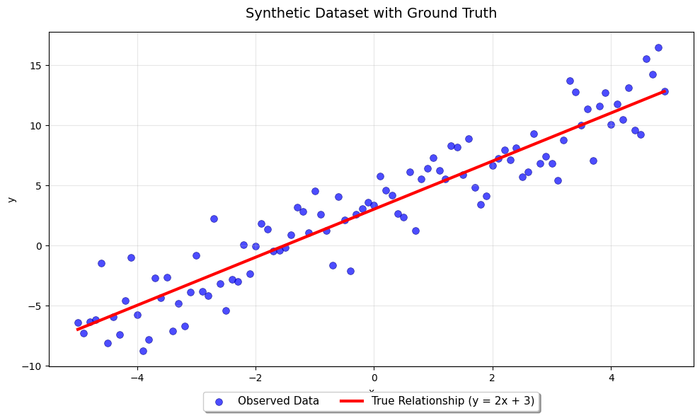
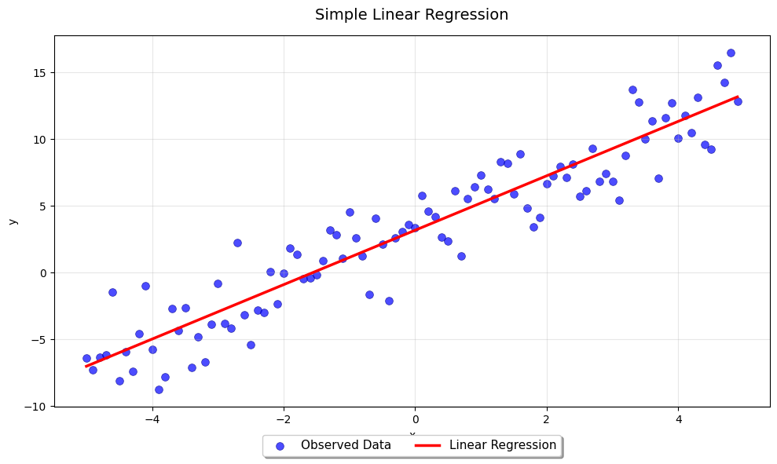
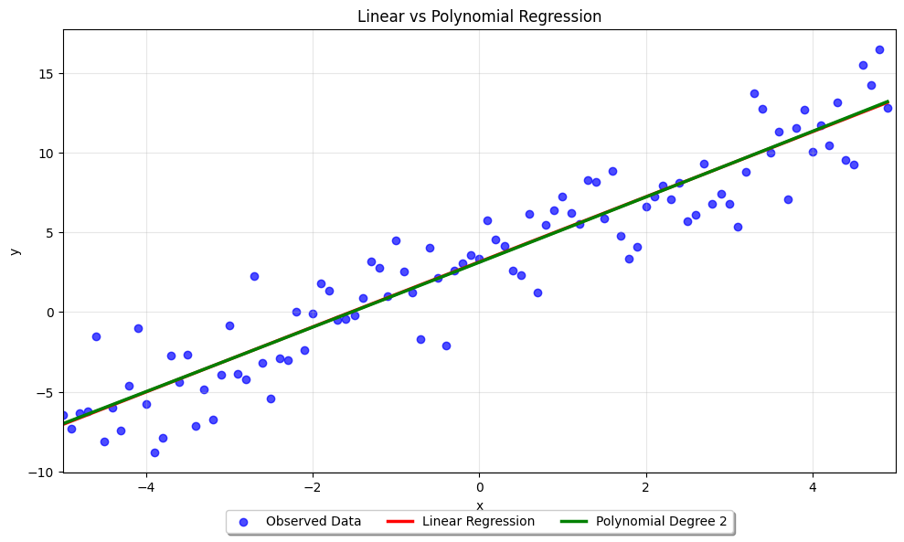

# More complex model ≠ better model  
### (That’s literally Occam’s Razor in action)

> A simple, reproducible example showing why a more complex model is not always better — even on perfectly linear data.

Today I created a perfectly linear dataset:  
**y = 2x + 3 + some random noise**

Then I trained two models:
- Simple Linear Regression → Test R² ≈ 0.8626
- Polynomial Degree 2 (more complex) → Test R² ≈ 0.8623

Guess what?  
The complex model did slightly better on training data…  
but **performed worse (or at best equal) on unseen test data**.

This notebook walks through the entire experiment — step by step — with clean plots and real numbers.  
It’s a classic illustration of **overfitting** and why **Occam’s Razor** matters in machine learning.

Let’s dive in.

## 1. Import Libraries & Generate Synthetic Linear Data with Noise

We generate a perfectly linear dataset based on the true relationship **y = 2x + 3**.  
Then we add Gaussian noise to scatter the points slightly off the line — just like real-world data.

Why add noise?  
Because in practice, data is never perfectly clean.  
This noise tempts the polynomial model to fit random fluctuations instead of the underlying pattern — classic overfitting.  
Meanwhile, the simple linear model ignores the noise and captures only the true signal.


```python
import numpy as np
import pandas as pd
import matplotlib.pyplot as plt
from sklearn.linear_model import LinearRegression
from sklearn.preprocessing import PolynomialFeatures
from sklearn.metrics import r2_score
```

### Generate perfectly linear data with noise


```python
x = np.arange(-5.0, 5.0, 0.1)
y_true = 2 * x + 3
y_noise = 2 * np.random.normal(size=x.size)
y = y_true + y_noise
```

### Plot: Data + True Relationship


```python
plt.figure(figsize=(10, 6))
plt.scatter(x, y, marker='o', color='blue', alpha=0.7, s=50, label='Observed Data', edgecolor='navy', linewidth=0.5)
plt.plot(x, y_true, color='red', linewidth=3, label='True Relationship (y = 2x + 3)')

plt.title('Synthetic Dataset with Ground Truth', fontsize=14, pad=15)
plt.xlabel('x')
plt.ylabel('y')

plt.legend(loc='lower center', bbox_to_anchor=(0.5, -0.15), ncol=2, fancybox=True, shadow=True, fontsize=11)

plt.grid(True, alpha=0.3)
plt.tight_layout()
plt.show()
```


    

    


## 2. Convert to DataFrame & Train/Test Split

We convert the data into a pandas DataFrame for easier handling and cleaner syntax (e.g., `df['x']` instead of indexing arrays).

Then we randomly split it into training (80%) and testing (20%) sets.  
This split is crucial — it allows us to evaluate how well each model generalizes to unseen data, which is exactly where overfitting reveals itself.


```python
X = x.reshape(-1, 1)
data = np.column_stack((x, y))
df = pd.DataFrame(data, columns=['x', 'y'])
msk = np.random.rand(len(df)) < 0.8
train = df[msk]
test = df[~msk]

train_x = train[['x']]
train_y = train[['y']]
test_x = test[['x']]
test_y = test[['y']]
```

## 3. Simple Linear Regression

We fit a basic linear model and evaluate it on the test set.


```python
reg_linear = LinearRegression()
reg_linear.fit(train_x, train_y)
```


```python
coef_linear = reg_linear.coef_[0]
intercept_linear = reg_linear.intercept_
```


```python
pred_linear = reg_linear.predict(test_x)
r2_linear = r2_score(test_y, pred_linear)
```


```python
print(f"r^2 SimpleRegressionLinear : {r2_linear:.4f}")
print(f"coef_ : {coef_linear}")
```

    r^2 SimpleRegressionLinear : 0.8626
    coef_ : [2.03889206]


```python
plt.figure(figsize=(10, 6))
plt.scatter(df.x, df.y, color='blue', marker='o', alpha=0.7, s=50, label='Observed Data', edgecolor='darkblue', linewidth=0.5)

plt.plot(df.x, intercept_linear + coef_linear * df.x, color='red', linewidth=2.5, label='Linear Regression')

plt.title('Simple Linear Regression', fontsize=14, pad=15)
plt.xlabel('x')
plt.ylabel('y')

plt.legend(loc='lower center', bbox_to_anchor=(0.5, -0.15), ncol=2, fancybox=True, shadow=True, fontsize=11)

plt.grid(True, alpha=0.3)
plt.tight_layout()
plt.show()
```


    

    


## 4. Polynomial Regression (Degree 2)

Now we increase model complexity by adding x² as a feature using `PolynomialFeatures`.


```python
poly = PolynomialFeatures(degree=2)
poly_train_x = poly.fit_transform(train_x)
poly_test_x = poly.transform(test_x)

poly_train_x = poly.fit_transform(train_x)
poly_test_x = poly.fit_transform(test_x)

reg_poly = LinearRegression()
reg_poly.fit(poly_train_x, train_y)
```


```python
poly_test_y_poly = reg_poly.predict(poly_test_x)
r2_poly = r2_score(test_y, poly_test_y_poly)
```


```python
coef_poly = reg_poly.coef_[0]
intercept_poly = reg_poly.intercept_
```


```python
print(f"r^2 PolynomialRegressionLinear : {r2_poly:.4f}")
print(f"coef_ : {coef_poly}")
```

    r^2 PolynomialRegressionLinear : 0.8623
    coef_ : [0.         2.03959043 0.00316868]


## 5. Final Comparison & Overfitting Detection

We compare both models side-by-side. Notice how the polynomial model fits the training noise slightly better — but performs worse on test data.


```python
print(f"performance simple linear regression on train data : {reg_linear.score(train_x, train_y):.4f}  and test data: {reg_linear.score(test_x, test_y):.4f}")
print(f"performance poly linear regression on train data : {reg_poly.score(poly_train_x, train_y):.4f}  and test data: {reg_poly.score(poly_test_x, test_y):.4f}")
```

    performance simple linear regression on train data : 0.8926  and test data: 0.8626
    performance poly linear regression on train data : 0.8926  and test data: 0.8623


```python
plt.figure(figsize=(10, 6))
plt.scatter(df.x, df.y, color='blue', marker='o', alpha=0.7, label='Observed Data')
plt.plot(df.x, intercept_linear + coef_linear * df.x, color='red', linewidth=2.5, label='Linear Regression')
plt.plot(df.x, intercept_poly + coef_poly[1] * df.x + coef_poly[2] * np.power(df.x, 2), color='green', linewidth=2.5, label='Polynomial Degree 2')
plt.title('Linear vs Polynomial Regression')
plt.xlabel('x')
plt.ylabel('y')
plt.legend(loc='lower center', bbox_to_anchor=(0.5, -0.15), ncol=3, fancybox=True, shadow=True)
plt.grid(True, alpha=0.3)
plt.xlim(-5, 5)
plt.tight_layout()
plt.show()
```


    

    


## Conclusion

- The true relationship is perfectly linear
- The polynomial model (more complex) slightly overfits the training noise
- The simpler linear model achieves **better generalization** on test data
- This demonstrates **Occam's Razor**: Among models with similar explanatory power, prefer the simpler one

> **Less is often more in machine learning.**
